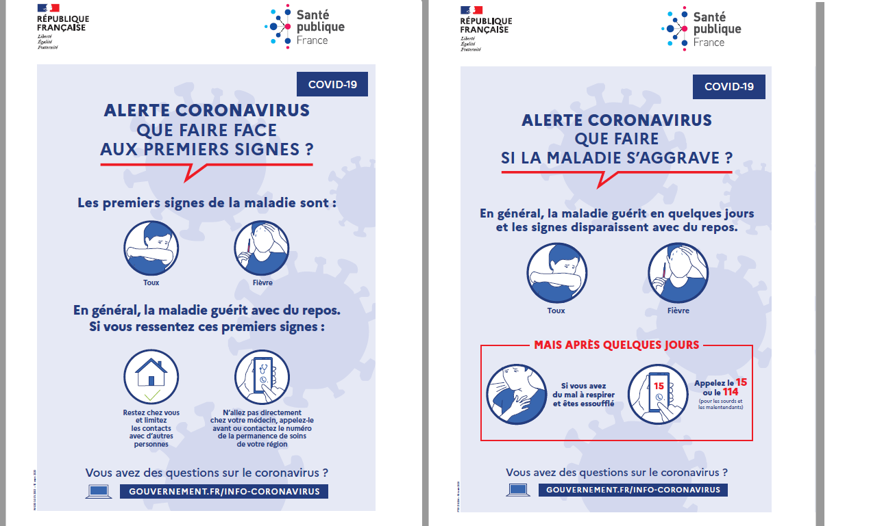
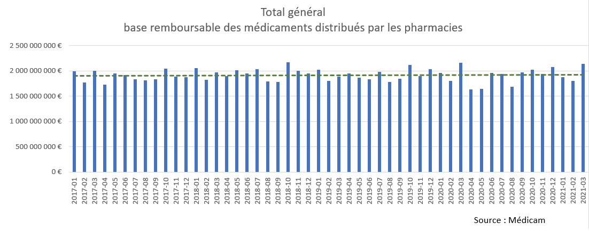
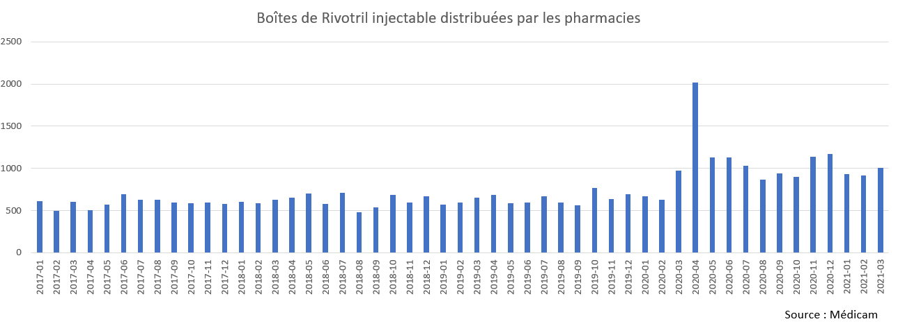
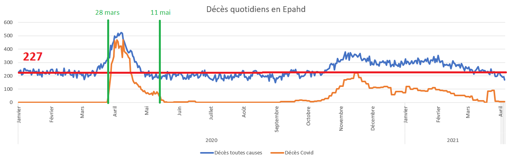
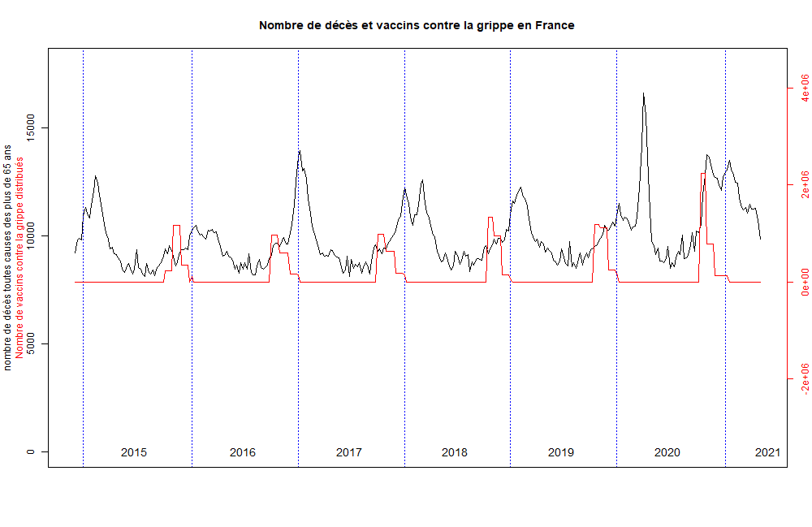
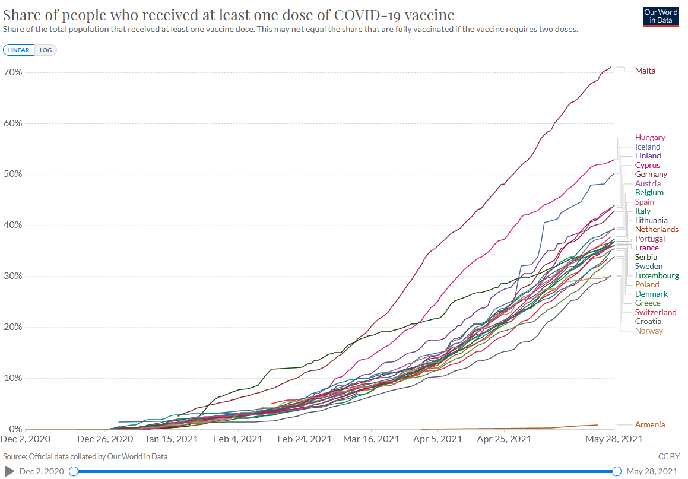

```{r setup, include=FALSE}
knitr::opts_chunk$set(echo = TRUE)
```

# Comprendre les données de mortalité européenne pour prendre les bonnes décisions

## La nécessité de s'affranchir des biais de perception

Cet article a pour objectif d'analyser les données de mortalité de 33 pays européens afin de comprendre les dynamiques en jeu depuis plus d'un an.

Toutes les données utilisées proviennent de sources officielles :

- Eurostat pour les décès et la population par âge des pays européens

- Insee pour les données détaillées françaises

- Ourworldindata pour les données de malades, décès et vaccination en lien avec la Covid 19

- Médicam pour les données des médicaments délivrés les les pharmacies de ville

- Ecdc pour les données des mesures prises par les différents pays

Toutes les données de mortalité utilisées dans cet article, sont des données de mortalité toutes causes confondues et pas uniquement des données de mortalité de la seule cause Covid-19. En effet pour considérer qu'une maladie est mortelle, il faut qu'elle ait un impact sur la mortalité générale, et pas uniquement compter les décès de personnes qui en sont porteuses. Chacun conviendra que cela n'aurait aucun sens statistique de compter les décès survenus après la dégustation d'une glace à la vanille. Pourtant en le faisant nous verrions une forte augmentation de ces décès l'été, uniquement parce qu'en France 1500 personnes décèdent tous les jours l'été, et qu'à cette période, elles dégustent plus souvent des glaces à la vanille. Il s'agit de ce que l'on appelle un biais de perception.

Le fait de présenter en permanence des statistiques de mortalité de personnes porteuses de la Covid induit un biais de perception. Il laisse imaginer que ce virus est la seule cause de mortalité aujourd'hui sans jamais confronter ces décès au nombre de décès habituels de chaque pays. Dans ce contexte, il est impossible de réaliser une recherche raisonnable des causes de décès depuis mars 2020 : c'est la Covid-19 qui s'impose et rien d'autre n'est envisageable. C'est le contraire d'une démarche scientifique.

Pour cette raison, cet article se base uniquement sur les décès toutes causes et met en lien les différents évènements et choix qui ont été pris dans les différents pays, afin de chercher des causes de décès sans biais préalable.

Les données des décès toutes causes sont étonnamment et malheureusement beaucoup plus difficiles à trouver. On ne peut qu'être surpris de constater qu'elles ne bénéficient pas de la diffusion des statistiques de la Covid et ses nombreux sites internet redoublant d'interfaces graphiques. Elles doivent être téléchargées sur des sites spécialisés et retravaillées pour les rendre exploitables. Elles sont pourtant les seules permettant une analyse objective de la situation. Il "suffirait" pourtant à des sites tels qu'Ourworldindata de se "brancher" sur les sites officiels de dépôts de données statistiques tels qu'Eurostat pour proposer des graphiques et animations éclairant le débat sur de nombreux sujets. Eurostat propose même une interface de programmation d'application (API) permettant à toute personne de télécharger et d'utiliser n'importe quelle base de données. 

Concernant Ourworldindata, il ne s'agit pas d'un problème de "place" puisque le site héberge déjà 300 thèmes et plus de 3000 visualisations de données. Il s'agit d'un choix éditorial. Les thèmes et graphiques proposés dans tout exercice de communication correspondent à des choix discutés et validés. Sur Ourworldindata, les données mises en valeur sont actuellement représentatifs des centres d'intérêts politiques et médiatiques aujourd'hui : croissance de la population, espérance de vie, pollution, dépenses gouvernementales, corruption et bien évidemment Covid-19. Il s'agit bien d'un site de communication dont l'enjeu est de convaincre (ou persuader), et non pas un site de recherche dont le but est de questionner pour comprendre.


Cet article présente en première partie le bilan de l'année 2020 pour montrer que dans sa globalité, cette année est loin d'être exceptionnelle du point de vue de la mortalité. Ce résultat est confirmé pour tous les pays d'Europe pour lesquels nous avons des données de population et de décès.

En seconde partie, cet article présente les décès semaine après semaine de tous les pays européens. Pour comprendre les dynamiques en jeu, 3 périodes de mortalité liées à la Covid-19 seront étudiées :

- la période de mars-avril 2020, spécifique à un nombre restreint de pays européens

- la période d'octobre à décembre 2020 qui présente une hausse des décès inhabtiuelle

- la période depuis début 2021 qui présente un rebond de mortalité lui-aussi inhabituel


Nous verrons que dans les 3 cas, la mortalité est liée non pas à la seule présence d'une nouvelle maladie, mais directement aux choix de politiques sanitaires pris. Dans tous les cas, la croyance dans des modèles de propagation épidémique a induit les pouvoirs publics en erreur. La lutte contre la propagation au détriment de la qualité des soins s'est finalement révélée catastrophique. Cette expérience prouve que les modèles épidémiques utilisés sont déconnectés de la réalité et que seule la qualité du soin prévaut. Au regard des données collectées de mortalité, nous questionnons la stratégie de santé mise en place depuis plus d'un an, du port du masque au confinement total et jusqu'au pari vaccinal au détriment du soin classique.

## 1. Du point de vue de la mortalité, l’année 2020 est comparable au reste de la décennie pour une majorité de pays d'Europe

### 1.1 Quelques rappels pour la France : l’importance du vieillissement de la population

Dans plusieurs vidéos de la chaîne Décoder l'éco, par exemple celle qui compare les décès de toutes les années entre 1962 et 2020 [^n1] nous avons vu que la mortalité en France depuis 2020 n’est pas unique et est au niveau de l’année 2015. 

En effet, la France vieillit. Ainsi le nombre de morts chaque année augmente naturellement depuis 2010. 

```{r, echo=FALSE}
options(scipen=999)
barplot_deces_france <- readRDS("gen/rds/Eurostat_barplot_deces_france.RDS")
barplot_deces_france

```

Cette hausse du nombre de décès n’est pas le signe que la santé des français se dégrade, mais uniquement le résultat de l'augmentation du nombre de personnes âgées. En effet, à force de vieillir, tous les humains finissent par mourir. Pour l'illustrer, voici la pyramide des âges de la France en 2000 et en 2020, réalisée avec les données disponibles sur Eurostat.

 {width=450px} {width=450px}
En 20 ans, la génération des baby-boomers est, logiquement, passée de la tranche des moins de 55 ans à celle des plus de 65 ans. Dès lors, il est tout à fait normal que le nombre de décès en France augmente chaque année, et cela va continuer à augmenter pendant encore au moins 20 ans.

Ainsi, il ne faut jamais commenter des nombres de décès bruts qui augmentent ou baissent non pas selon l'arrivée des maladies, mais toujours selon la taille de la population et selon l'âge des personnes. En effet, s'il y a plus de décès en France qu'au Luxembourg, c'est parce que les français sont 100 fois plus nombreux que les Luxembourgeois. S'il y a plus de décès dans un EHPAD de 200 personnes que dans une école maternelle de 200 enfants, ce n'est pas parce que l'EHPAD est plus dangereux que l'école maternelle, mais uniquement parce que les résidents d'un EHPAD sont beaucoup plus vieux que les élèves d'une école maternelle. Ainsi, comparer des nombres de décès entre 2 populations ne peut pas se faire avec les seuls chiffres bruts, mais toujours en corrigeant de la taille de la population, et aussi en corrigeant de l’âge des gens. Il s'agit de standardiser les décès pour mettre la même population partout.

Pour comparer le nombre de décès en France de ces dernières années avec l'année 2020, nous avons standardisé les décès, en appliquant la population par âge de 2020 à toutes les années du passés. Il en est ressorti que l’année 2020 n’est pas du tout une année de record de mortalité. 

```{r, echo=FALSE}
options(scipen=999)
barplot_decestheo_france <- readRDS("gen/rds/Eurostat_barplot_deces_theo_france.RDS")
barplot_decestheo_france

```

L’année 2020 est au niveau de l'année 2015. Il s'agit de la 6e année la moins mortelle de toute l’histoire de la France. Dès lors, on ne peut justifier une panique sanitaire et des mesures exceptionnelles sur la base des décès de l'année 2020 en France.  

Cette situation est la même quel que soit le pays en Européen considéré.


### 1.2 L’année 2020 en Europe : Une année dans la norme pour tous les pays

Tous les pays européens vivent au rythme des nouvelles annonces et mesures concernant la Covid-19 depuis plus d’un an. Mais qu’en est-il réellement du point de vue de la mortalité ? L’année 2020 est-elle vraiment une année d’hécatombe quelque part ?
Cette carte d’Europe représente l’année pour laquelle chaque pays européen, dont nous disposons des données, a connu le plus de décès.

 

En marron, nous retrouvons tous les pays pour lesquels l’année 2020 est l’année pour laquelle il y a eu le plus de décès. C’est bien le cas de la majorité des pays d’Europe. On note toutefois quelques exceptions, en particulier les pays nordiques. Cette carte est réalisée avec des données brutes. Comme nous l'avons vu pour la France, les données brutes reflètent avant tout l'augmentation et le vieillissement de la population. 

La pyramide des âges des pays Européens révèle une situation européenne semblable à celle de la France : la population vieillit. Il est tout à fait normal que le nombre de décès augmente chaque année du fait de ce simple constat.

 {width=450px} {width=450px}

Ainsi, plutôt que de regarder les décès bruts, il est nécessaire de les corriger par la pyramide des âges, de façon à prendre en compte l'augmentation et le vieillissement de la population dans les calculs. Cela permet de ne pas dire que la mortalité augmente, si cela vient juste du fait qu’il y a plus de personnes âgées.

En calculant pour chaque pays, les décès standardisés par âge, pour toutes les années, il est désormais possible de les comparer aux décès 2020. Cela permet de savoir si à population égale, l’année 2020 a été réellement plus mortelle que les autres. Ce calcul, permet de déger 5 profils type de pays représentés sur cette carte.

 

Pour l’Islande, la Norvège et le Danemark , l’année 2020 est en fait l’année la moins mortelle de toute leur histoire. Dans ces pays, les habitants ne sont jamais moins morts qu’en 2020. Ce n’est pas pour autant qu’ils n’ont pas de morts attribués à la Covid-19,  mais dans ces pays, malgré la pandémie annoncée, l’année 2020 est le record absolu de plus faible mortalité.

L'Allemagne, la Suède, la Finlande, l'Estonie et la Lituanie ont vécu la 2e année la moins mortelle de toute leur histoire. Seule l'année 2019 a enregistré moins de décès. En effet, pour l'écrasante majorité des pays d'Europe, l'année 2019 a été un record de sous-mortalité qui sera très difficile à battre, même en enfermant toute la population.

Une majorité des pays d'Europe, dont la France, a vécu une année 2020 dans la norme de la décennie. Les pays en orange clair sont plutôt dans la 2e moitié de la décennie, autour des années 2015-2016. Les pays en orange foncé sont plus souvent autour de l'année 2012.

Seuls l'Espagne, l'Italie, la Belgique, la Roumanie, la Bulgarie la Pologne et le Monténégro ont connu une mortalité forte pour la décennie. Ainsi, les pays d'Europe ayant connu les plus fortes mortalités relativement à ce qu'ils enregistrent habituellement, ont connu une mortalité de l'ordre de la 10e plus faible de toute leur histoire.

L'année 2020 présentée comme une hécatombe mondiale, n'est en fait qu'une année pendant laquelle, au pire, les humains sont morts dans les mêmes proportions que l'année 2010. Ce qui est montré depuis 6 mois pour la France sur la chaîne Décoder l'éco, est donc réplicable pour tous les pays pour lesquels des données sont disponibles. 

Au bilan, pas un seul pays d'Europe n'a vécu une "hécatombe" en 2020. Pour les pire cas, 2020 est juste aussi mortelle que 2010.

### 1.3 La mortalité en Europe : le pays de résidence bien plus déterminant que l'année 

Nous venons de voir qu'en corrigeant les décès de la pyramide des âges de chaque pays, on montre que 2020 est finalement une année mortalité dans la norme de la décennie. Afin de compléter notre vision, il est important de comparer les pays entre eux. 
Seulement les populations des pays européens sont trop différentes pour être comparables. Entre l'Allemagne et ses 83 millions d'habitants et le Liechtenstein et ses 38 000 habitants, il est impossible de faire un graphique à la même échelle. Il est donc nécessaire de les comparer sur une même base.
Pour ce faire, nous allons appliquer la même pyramide des âges à tous les pays Européens. Ainsi nous pourrons savoir, dans quel pays et pendant quelle année, les européens sont le plus décédés.

Ces graphiques représentent les décès théorique pour chaque pays et chaque année, s'ils avaient eu la population et la pyramide des âges de la France en 2020. Il sont séparés entre les pays de l'Est et les pays de l'Ouest de l'Europe pour une question de visibilité, mais également parce que ces 2 zones de l'Europe sont assez différentes du point de vue de la mortalité.

Les décès théoriques de 2020 pour chaque pays sont signalés en rouge et les autres points en dégradé de bleu représentent les décès théoriques des autres années.

Par exemple, si la population de la France de 2020 étaient décédée de la même manière que la Bulgarie en 2020, il y aurait eu 1 300 000 morts au lieu des 660 000 qu'elle a vécu.


{width=1000px} 
{width=1000px}

Cela montre qu'à population et pyramide des âges égales, les bulgares meurent deux fois plus que les français.

Ainsi, si la Bulgarie n'a pas 2 fois plus de morts que la France chaque année, c'est d'abord parce que les Bulgares sont 7 millions et les français 67 millions, mais aussi parce que les Bulgares sont plus jeunes que les français.

Les Bulgares sont plus jeunes que les français notamment parce qu'ils meurent plus jeunes. Il y a donc moins de personnes dans leur population qui peuvent arriver à des âges avancés. Ils décèdent petit à petit plus fortement que les français.

Les différences de mortalité d'une année à l'autre sont parfaitement négligeables devant les différences d'un pays à l'autre. La probabilité de décéder à chaque âge dépend avant tout de l'endroit où l'on vit et moins des années.

Si on se met à la place d’un Bulgare. Grace à se graphique, nous apprenons que la mortalité en Bulgarie est 2 fois plus élevée que celle de la France à population égale. Ne faudrait-il pas se dire qu’il y a certainement des choses à faire sur la pauvreté et la santé en Bulgarie pour se rapprocher de la situation de la France. Nous constatons que la Bulgarie constate juste une augmentation de 10% de mortalité en 2020 par rapport à 2019, pour se retrouver au niveau de la mortalité de l’année 2015, et que cela est sensé déclencher une énorme panique. En nombre de décès standardisé, c’est comme si chaque année, la Bulgarie avait 500 000 morts de plus que la France, et qu’elle trouvait ça tout à fait normal, mais qu’elle paniquait en 2020 pour 100 000 morts de plus que 2019.

C’est comme si un éléphant et une colonie de fourmis montaient sur un bateau, que le bateau se mettait à couler et que l’éléphant réussissait à convaincre les fourmis de sauter une à une du bateau jusqu’à ce qu’il flotte de nouveau.

Ce graphique montre que les évènements particuliers ont peu d’impact sur la mortalité et que ce sont les effets structurels, de la santé des habitants et de la qualité du système de santé qui prévalent.

Ce graphique montre également que les français vivent dans l'un des pays d'Europe, et donc du monde, au sein duquel on meurt le moins.

Nous avons montré plus haut que l'année 2020 est la 6e année pour laquelle les français sont le moins mort. Ce graphique nous montre que la mortalité de la France en 2020 a été une des plus faibles jamais enregistrée dans tous les pays du monde.
Pour la quasi totalité des humains ayant jamais vécu sur cette planète, l'année 2020 en France est l'un des endroits et moment où on a connu le moins de morts.

Il n'est donc à aucun moment justifiable de générer une panique et des mesures d'une ampleur colossale pour des décès qui ne sont nulle part exceptionnels, et surtout pas en France.

### 1.4 Une baisse de mortalité aujourd'hui n'entraîne pas une baisse de la mortalité demain

De nombreuses études commentent l'année 2020 au regard de son augmentation par rapport à 2019. Ces études considèrent que la baisse de mortalité observée ces dernières années et tout particulièrement en 2019 doit se poursuivre. Ainsi, les morts en plus de l'année 2020 sont considérées comme une catastrophe évitable attribuée à un virus.

Seulement, imaginer que la baisse de mortalité peut se poursuivre indéfiniment revient tout bonnement à nier que les humains finissent par mourir.

L'année 2019 a connu une mortalité extrêmement faible partout en Europe. Il semble banal de penser que si des morts sont évités une année, elles finiront par se répercuter sur les années suivantes et non pas ne plus jamais survenir. Encore en 2020, on ne peut pas éviter la mort, au mieux on la repousse.

Si on imagine un cas théorique où on trouverait un territoire sur lequel personne n'est mort pendant une année. Il ne viendrait à l'idée de personne que les habitants de ce territoire vivraient éternellement. Pourtant, la projection de la mortalité de ce territoire supposerait qu'il n'y ait pas de morts non plus l'année suivante. Avec cette méthode, tout mort serait alors suspect et compté comme de la surmortalité.

Ce cas trivial est pourtant ce qui est fait lorsque l'on compare l'année 2020 à la seule année 2019, ou que l'on essaye de continuer de faire baisser indéfiniment des taux de mortalité.

Sur le graphique du nombre de décès français, on observe certaines années plus ou moins élevées par rapport à la tendance générale. Dans la littérature, les années de fortes mortalité sont appelées années moissons.  

```{r, echo=FALSE}
barplot_deces_france <- readRDS("gen/rds/Eurostat_barplot_deces_france.RDS")
barplot_deces_france

```

Ces années apparaissent tous les 2 à 3 ans. Ainsi, pour comprendre si les décès d'une année ont un impact visible sur une période, une méthode peut consister à regarder les décès sur 3 années consécutives.
Le dernier trio d'années, 2018-2019-2020 est en rouge pour plus de visibilité.

{width=1000px}

Sans surprise, pour la quasi-totalité des pays européens, il n'est jamais décédé aussi peu de personnes relativement à leur âge que ces 3 dernières années. L'année 2020 n'a pas entièrement contrebalancé les faibles mortalités des années 2018 et 2019.

### 1.5 La chute de l'espérance de vie n'est qu'une autre manière de présenter le même résultat

Le 19 janvier 2021, l’Insee a sorti son bilan démographique de l’année 2020 [^n2] en décidant de mettre comme titre « Avec la pandémie de Covid-19, nette baisse de l’espérance de vie et chute du nombre de mariages ». Bien évidemment, la presse s’est emparée de ce titre pour expliquer à quel point la situation était grave. Les journalistes ont bien évidemment déduit du titre de l’Insee, que les français ont vécu moins longtemps que d’habitude, et qu’en plus cette diminution était causée par la Covid-19.

D’ailleurs, un des sous-titres de l’article de l’Insee est directement "En 2020, la pandémie a fait perdre 0, 4 an d’espérance de vie aux femmes et 0, 5 an aux hommes". Ainsi le lien est direct : c’est la pandémie qui tue.

La vidéo dédiée sur la chaîne Décoder l'éco [^n3] détaille le calcul de l’espérance de vie. Cet indicateur fait partie de la famille des agrégats. C’est-à-dire qu’il est construit en additionnant des choses qui vont dans tous les sens et finalement ne renseigne pas du tout sur ce qu’il se passe vraiment. Il a juste un joli nom induisant les gens en erreur, pensant avoir compris ce qu’il signifie.

Le mot « espérance » est un terme utilisé en mathématiques qui signifie « moyenne sur un grand nombre de fois », en tenant compte de la pondération comme toute moyenne. Par exemple lorsque vous lancez 2 dés à 6 faces, et que vous additionnez le nombre de points sur vos 2 dés, en moyenne, vous faites 7, votre espérance mathématique est 7. On ne connaît pas le résultat de votre prochain lancé. L’indicateur « espérance de vie » n’est donc pas du tout à entendre au sens de « espoir » et encore moins « nombre d'années que vous pouvez espérer vivre ». L’espérance de vie ne vous renseigne pas du tout sur votre avenir, mais est juste une image du présent. L’espérance de vie 2020, est une moyenne standardisée de l’âge des gens morts en 2020. Elle nous donne une idée de l’âge des morts en 2020, en tenant compte de la structure par âge. L'espérance de vie 2020 ne correspond absolument pas à l'âge que vous pourrez espérer vivre. Si vous lisez cet article, vous n'êtes pas morts en 2020. Vous ne jouez pas avec les mêmes dés que ceux qui sont morts en 2020 ou avant.

Dans le présent article nous utilisons une autre forme de standardisation que l'espérance de vie. Elle donne exactement la même conclusion que celle de l'article de l'INSEE. Sur l'article de l'INSEE nous pouvons lire que l'espérance de vie 2020 est la même que l'espérance de vie 2015, sur notre article nous concluons que les décès standardisés de 2020 sont aussi nombreux qu'en 2015. Se focaliser sur la chute plutôt que sur le niveau, et sur le terme "espérance de vie" sans l'expliquer n'est qu'un choix éditorial et pas une analyse approfondie.

## 2 Des pics de mortalités à relier aux décisions prises depuis 2020

Depuis le début de l'année 2020, des décisions inédites ont été prises en France et dans beaucoup de pays du monde. Ces décisions avaient pour objectif de diminuer le nombre de décès. Nous avons vu dans la première partie de cet article que finalement, la mortalité de 2020 ne présente pas d'anomalie alarmante lorsqu'elle est prise dans son ensemble et comparée aux années de la dernière décennie. Il convient cependant pour mieux comprendre les mécanismes en jeu depuis plus d'un an, et étudier finement les décès hebdomadaires des pays européens et de les confronter aux mesures prises.

### 2.1 La mortalité hivernale n'est pas un phénomène de propagation

L'étude de la carte des décès hebdomadaires standardisés en France depuis 2013 nous permet de visuliser les cycles de mortalité.
{width=1000px}

Chaque année, le nombre de décès augmente en hiver et diminue en été. Cette augmentation de décès l'hiver est concomitante des maladies hivernales, dont les infections respiratoires aiguës comme les grippes ou les coronavirus.

Certains hivers présentent des pics de mortalité nettement supérieurs à d'autres. L'hiver 2013-2014 a connu des pics de mortalité bien moins élevés que l'hiver 2014-2015. Cette différence fait partie des éléments expliquant les différences de décès d'une année sur l'autre.
De plus, certaines années les pics de décès peuvent être plus ou moins précoces ou tardifs. L'année 2017 supporte ainsi la majorité de la mortalité de l'hiver 2016-2017, mais également une importante partie de celle de l'hiver 2017-2018. Ainsi, le décalage des mortalités hivernales entraînent des différences de nombres de décès sur l'année.

Le découpage annuel n'est donc pas le plus adapté pour étudier la mortalité, car il découpe la mortalité hivernale de manière inégale selon les années. Il est cependant le plus facile à représenter, car correspond aux données administratives et statistiques.

Ce phénomène de mortalité hivernale est complètement simultané sur toute l'Europe. La standardisation des décès nous permet de représenter les différents pays et années sur un même graphique.

{width=1000px}
De la Suède jusqu'au Portugal, les hausses de mortalité sont naturellement simultanées tous les hivers, et même les étés lors des épisodes caniculaires.
La mortalité hivernale des pays européens n'est donc pas en lien avec un phénomène de diffusion de maladies l'hiver en Europe. Le Portugal et la Suède sont séparés par 3000 km. Si la diffusion entre individus de maladies l'hiver était responsable de l'augmentation de la mortalité, de décalages temporels devraient être visibles, ce qui n'est pas le cas.
L'augmentation des décès ne représente pas le déplacement des maladies, mais leur apparition partout à la fois. Il s'agit d'une manifestation de la dégradation cyclique de l'état de santé. Cette dégradation simultanée partout en Europe se traduit par l'apparition de symptômes attribués à des maladies hivernales et par l'augmentation des décès. Le phénomène de courbe en cloche concernant la mortalité n'est pas le résultat d'un phénomène de propagation, mais d'une phénomène d'apparition. Il est évident que les portugais ne contaminent pas les suédois, ni inversement.

Le même résulat se constate à des niveaux plus fins que les pays. En France, pour lequel nous avons des résultats départementaux, les pics de mortalité sont synchronisés. Ils sont plus ou moins visibles selon l'âge et la taille de la population.

### 2.2 le pic de mortalité de mars-avril 2020 ne concerne que peu de territoires

Contrairement à une idée largement répandue, le phénomène de pic de mortalité aux mois de mars-avril 2020 n'est absolument pas un phénomène mondial. Sur les 33 pays étudiés dans cet article, seuls 9 présentent une mortalité supérieure à la mortalité habituelle sur cette période : la Belgique, la Suisse, Chypre, l'Espagne, la France, l'Italie, le Luxembourg, les Pays-bas et la Suède (cf. annexes)

Ce phénomène très limité doit alors s'analyser au regard de la situation particulière de chaque pays et surtout des mesures spécifiques prises sur la période. Cet article présente les liens trouvés entre la hausse de la mortalité française et les mesures exceptionnelles prises.

Au niveau des départements français, le pic de mortalité de mars-avril 2020 n'a touché ni tous les territoires, ni avec la même intensité pour tous les territoires touchés. En revanche, tous les territoires touchés par cepix de mortalité l'ont été de manière synchronisé. Nous avons donc un pic de mortalité qui ne touche pas tous les pays d'Europe, et au sein de chaque pays, pas tous les territoires, mais dont tous les territoires touchés le sont en même temps.

En Île-de-France par exemple, tous les départements connaissent une hausse de mortalité synchronisée débutant arpès le début du confinement identifié ici en bleu.

{width=1000px}
A l'inverse, en Nouvelle-Aquitaine, auncune hausse de mortalité n'est visible sur la période.

{width=1000px}
Nous constatons également que les territoires touchés par cette hausse de mortalité sont majoritairement des départements avec des villes de tailles importantes (cf. annexes) et donc des quartiers avec de très forts taux de pauvreté. L'Insee révèle logiquement [^n23] que la mortalité de cette période touche beaucoup plus fortement les communes denses et les personnes nées à l'étranger. Il est étonnant de la part de l'Insee qui produit les statistiques annuelles de pauvreté, de ne pas faire le lien entre les conditions de vie et de salubrité difficiles des quartiers pauvres, et la hausse de la mortalité. Une fois de plus, il ne s'agit pas d'un problème de propagation, mais de santé publique sur des territoires particuliers.

### 2.3 Le lien entre les mesures françaises et les variations de mortalité 

En France, l'année 2020 comporte plus de décès que l'année 2019 notamment par la mortalité tardive visible aux mois de mars-avril, mais également à la mortalité précoce arrivant en octobre. Un lissage des décès sur 52 semaines, nous permet de connaître l'impact de ces augmentations sur la mortalité habituelle.

La moyenne et les deux bornes des intervalles de confiance à 95 %, permettent de visualiser les périodes de mortalité anormale.

{width=1000px}

Ainsi, arrivé au mois de mars 2020, la France était sur une moyenne très basse de décès relativement aux années précédentes. Le pic de mars-avril en France a entraîné un rapprochement vers la moyenne de décès habituels, sans la franchir. Il s'agit donc d'un phénomène brutal avec un impact limité. La mortalité lissée sur 52 semaines ne dépasse la moyenne des 5 dernières années que depuis la hausse de mortalité en octobre 2020.

Il s’agit ici de recenser les éléments qui peuvent expliquer une montée de la mortalité en France en mars-avril 2020, de façon à évaluer ce qui pourrait être imputable au seul virus et ce qui est imputable au reste.
 
En France, deux mesures structurantes concernant la politique de santé publique ont été prises :

- Le confinement, c’est-à-dire une limitation extrême des mouvements et l’ordre à tous les français de rester chez eux.

- L’interdiction aux médecins de ville d’appliquer leur art, autrement-dit de proposer des traitements pour limiter le risque de complication. Le débat s’est focalisé sur l’hydroxychloroquine, mais l’interdiction ne se limite pas à cette molécule, mais à toute substance en dehors du doliprane.
    
Ces 2 mesures ont des impacts sur l'évolution des infections respiratoires chez les patients, mais également sur toutes les pathologies habituelles.
 
#### 2.3.1 La mortalité des causes autres que les infections respiratoires aiguës telles que la Covid-19

Parmis les 9 pays ayant connu une surmortalité au mois de mars-avril, 7 ont mis en place un confinement à cette période. Dans tous ces pays, le seuil de surmortalité a été franchis après le début du confinement. En tenant compte du délai d'arrivée des données, on conclue que la décision du confinement n’a jamais pu être déclenchée par réaction à une surmortalité. Aucun décideur ou spécialiste ne pouvait savoir si la période connaîtrait plus de décès qu'habituellement. La décision a été prise notamment suite à la pression médiatique suivant des remontées de cas Covid. Il s’agit donc d’une mesure forte qui a des impacts très lourds sur l'organisation de la santé qui est prise avant de connaître le niveau de danger encouru.

Il est notable qu'absolument tous les cas de figure existent en Europe, entre confinement ou non et surmortalité ou non. Les deux effets ne sont pas entièrement liés. Pour conclure de l’effet positif ou négatif d’une telle mesure, il est possible de quantifier quelques effets.

Beaucoup de journaliste écrivent que le confinement strict a permis de sauver de nombreuses vies par l’absence des accidents de voiture. Il est aisé de quantifier le nombre de vies sauvées au maximum par une telle mesure. Il y a environ 3 600 décès sur la route par an en France, soit 300 par mois, cela fait environ 600 décès sur la période de confinement. Les ¾ de ces décès concernent des moins de 65 ans [^n4].

En effet, en écrasante majorité, les personnes qui prennent leur voiture tous les jours pour aller au travail ont moins de 65 ans. La Covid au contraire touche les plus de 65 ans. L’impact du confinement sur la sécurité routière aura pu sauver une partir des 600 décès possibles, mais en écrasante majorité des jeunes, alors qu’ils ne risquent rien avec la Covid.

Parallèlement, le 7 mai 2020, dans son bulletin épidémiologique [^n5], Santé publique France tire la sonnette d’alarme sur le renoncement au soin.
En France, environ 120 000 infarctus sont dénombrés chaque année [^n6], soit 20 000 attendus pendant la période de confinement. De même, 150 000 AVC sont comptabilisés chaque année [^n7], soit 25 000 en 2 mois.
Contrairement aux accidents de la route, les AVC et les infarctus touchent majoritairement le même public que les victimes de la Covid.
Santé publique France nous révèle que pendant la dernière semaine de confinement, les hôpitaux ont relevé 300 personnes de moins aux urgences AVC et 300 personnes de moins aux urgences cardiaques qu’à la même époque en 2019. Deux hypothèses sont alors possibles :

-Les français n’ont pas fait d’AVC ni de crises cardiaques pour laisser toute la place aux malades de la Covid.

-Les français n’ont pas été pris en charge du fait de l’ordre de ne pas consulter et de rester chez soi. Ce ratio étalé sur 8 semaines représente 4 800 personnes non soignées.


Les pathologies non soignées du fait de l'ordre de ne pas consulter et de rester chez soi, ainsi que la peur panique engendrée par la pression médiatique quotidienne peuvent expliquer la surmortalité à domicile en France sur cette période détaillée sur le site de l'Insee [^n8].
Ces décès ne sont pas considérés comme ayant un quelconque rapport avec la Covid-19. Ils apparaissent pourtant aux mêmes périodes que ceux attribués à cette maladie.


{width=1000px}

Ce résultat de non-prise en charge peut expliquer le caractère particulier des données de Chypre.

{width=1000px}

De la même manière qu'en France, où l'on constate un nombre de décès inscrits à l'état civil plus important les lundis et mardis et très faibles les dimanches, à Chypre la fin du confinement n'est probablement pas liée à un excès mortalité, mais plutôt à la découverte tardive des décès non répertoriés.

#### 2.3.2 La mortalité des infections respiratoires aiguës telle que la Covid-19
 
La période de mars-avril est extrêmement particulière dans toute l’histoire du soin, car il s’agit de la première fois que l’on demande à des malades de ne pas consulter de généraliste, en particulier si le patient souffre d’une infection respiratoire.

{width=1000px}

Cet ordre a entraîné un comportement de la population inédit dont on peut voir les effets sur les statistiques d’achat de médicaments en pharmacie de la base de données Médicam.

Ce graphique représente la base remboursable de tous les médicaments vendus par les pharmacies en France, chaque mois.

{width=1000px}

Le mois de mars 2020 a connu une hausse de 13 % des ventes de médicaments par rapport à la moyenne 2017-2019, représentant le provisionnement des français à la suite de l’annonce du confinement généralisé. Les mois d’avril et mai 2020 présentent au contraire, des baisses de 15 % et 14 % par rapport à la moyenne. Ces baisses sont le reflet de la non-prescription par les médecins à la suite de l’ordre de ne pas consulter.

Cette chute est cependant bien plus forte concernant les traitements habituels prescrits dans le cadre des infections respiratoires aiguës. En particulier les antibiotiques permettant d’éviter les surinfections ont connu une chute sans précédent.

{width=1000px}

En mars, le provisionnement n’a pas existé et le total d’antibiotiques vendus est inférieur de 1 % à la moyenne 2017-2019. En avril et mai, les chutes de ventes furent respectivement de 40 % et 47 %. Depuis cette période, la vente d’antibiotiques est restée à des niveaux extrêmement bas, reflet du choix de ne pas proposer ce traitement en cas de Covid-19.
 
 
Ce choix de ne pas laisser les médecins de ville proposer de traitements dans le cadre d’une infection respiratoire aiguë pendant les mois de mars et d’avril, a entraîné une dégradation sans précédent de l’état de santé des patients. La non-prescription d’antibiotiques aura permis aux bactéries de proliférer chez les patients âgés et affaiblis.
Ainsi, à partir de fin mars, de nombreux français dont l’état de santé s’est dégradé à leur domicile affluent dans les services hospitaliers. Les coronavirus, comme la Covid-19, ont pu entraîner des lésions dans l’appareil respiratoire empêchant les patients de respirer. Ces lésions sont également des portes ouvertes aux surinfections bactériennes.
Les sujets âgés se présentant à la l’hôpital ont à la fois des « trous » dans les poumons les empêchant de respirer, mais également des bactéries se développant à la suite de ces lésions et de la chute des défenses immunitaires. Ces 2 pathologies combinées empêchent de répondre rapidement aux besoins du patient. Si une injection de corticoïdes pouvait permettre au patient de réparer les trous des poumons, elle accélèrerait la prolifération des bactéries, entraînant la mort par surinfection. A l’inverse, ne pas agir sur la mécanique respiratoire entraîne le décès du patient dans les plus brefs délais.
De nombreux patients sont décédés non pas à cause du caractère exceptionnel de la maladie, mais à cause du caractère exceptionnel de la situation : pas de prise en charge précoce, et pas de traitement antibiotique.

Une fois de plus, pour les personnes les plus pauvres et vivant dans les logements les moins salubres, pour lesquelles nous avons vu plus haut une plus forte hausse de mortalité, il est normal qu'un confinement à domicile forcé engendre une probabilité plus importante de souffrir d'une infection, que le manque d'antibiotique ne manquera pas de laisser s'aggraver.


Ce défaut de prise en charge a été quantifié par les deux membres du Conseil Scientifique, Arnaud Fontanet et Simon Cauchemez, pourtant à l’origine de cette stratégie. Leur article dans Science [^n9], utilise les données hospitalières françaises et notamment le temps de passage et réanimation et de décès depuis la prise en charge du patient. Les courbes les plus intéressantes ont été supprimés depuis de l'article principal, mais sont toujours disponibles dans les données complémentaires. Au pages 15 et 16 sont détaillés les nombres de jours que mettent les patients arrivant à l’hôpital avant d’aller en réanimation (graphique de gauche) et le nombre de jours qu’ils mettent avant de décéder (graphique de droite).

{width=1000px}

Ainsi, 50 % des patients arrivant à l’hôpital sont placés en réanimation dès de le premier jour et 17% des patients décèdent dès le premier jour. Ces ratios énormes prouvent que les patient arrivent trop tard à l’hôpital. On observe d’ailleurs une très forte différence entre le nombre de décès au jour 1 et le nombre de décès au jour 2, illustrant qu’une grosse partie des arrivées n’est plus sauvable. Les auteurs en déduisent d’ailleurs qu’il y a 2 courbes séparés entre ceux arrivant trop tard et les autres. C'est l'explication restante dans l'article toujours en ligne. 
Une lecture moins orientée déduit de cet énorme ratio de décès au premier jour que les soins sont trop tardifs. Il est donc très probable que les décédés des jours suivants soient également pour beaucoup du fait de personnes dont l’état a eu le temps de s’aggraver et dont certain auraient pu survivre si les soins avaient été précoces.
Ces 17% de patients arrivés trop tard représentent 3 000 personnes sur les 17 570 décès déclarés Covid-19 à l'hôpital sur cette période. Si on considère qu'un décès dans les 3 jours à l'hôpital est un signe d'une prise en charge trop tardive, le total de décès potentiellement évitable est alors de 6 000. 

Dans la vidéo "100 000 morts, vraiment ?"[^n11], nous détaillons par lieu les décès durant cette période pour trouver que la surmortalité à l'hôpital pendant l'épisode de mars-avril est de 6 000 personnes. Ainsi la surmortalité constatée est égale au nombre de décès précoces de l'hôpital entraînés par la non prise en charge des patients de façon précoce par les médecins de ville.


#### 2.3.3 L'accélération artificielle des décès

L'article 12-3 du chapitre 7 du Décret n° 2020-293 du 23 mars 2020 prescrivant les mesures générales nécessaires pour faire face à l'épidémie de Covid-19 dans le cadre de l'état d'urgence sanitaire décrète une dérogation au code de la santé publique [^n10] :

        la spécialité pharmaceutique Rivotril ® sous forme injectable peut faire l'objet d'une dispensation, jusqu'au 15 avril 2020, par les pharmacies d'officine en vue de la prise en charge des patients atteints ou susceptibles d'être atteints par le virus SARS-CoV-2 dont l'état clinique le justifie sur présentation d'une ordonnance médicale portant la mention “ Prescription Hors AMM dans le cadre du covid-19 ”.

Le Rivotril est un médicament antiépileptique dont l'utilisation n'a haibtuellement rien à voir les infections respiratoires, ni l'accompagnement palliatif par sédation. Dans la notice du vidal [^n12], il est mentionné comme contre-indications :

    Ce médicament ne doit pas être utilisé dans les cas suivants :

        insuffisance respiratoire grave,

        syndrome d'apnée du sommeil,

        insuffisance hépatique grave,

        myasthénie.

Ainsi, la dérogation du décret ne propose pas l'utilisation d'un sédatif, mais d'un médicament déclenchant l'arrêt de la respiration du patient et donc son décès anticipé. Le décret a eu cours du 28 mars au 11 mai, soit dans la période exacte sur laquelle est constatée le plus fort nombre de décès depuis la canicule de 2003. L'analyse des ventes de Rivotril en pharmacie dans sa forme injectable reflète l'ampleur de l'utilisation de ce produit.

{width=1000px}

Ainsi, contrairement aux antibiotiques, les ventes de boîtes Rivotril dans a forme injectable ont augmenté de 59 % au mois de mars et de 227 % en avril relativement à la moyenne observée entre 2017 et 2019. Cette augmentation sur mars-avril représente 1 700 boîtes du produit et plus de l'habitude. Précisons que chaque boîte contient 6 ampoules dont une à 2 sont utilisées par patient dans le cadre d'une fin de vie. 
Ces statistiques ne reflètent que partiellement l'utilisation de cette molécule, car elles ne prennent pas en compte les doses qui ne sont pas distribuées par les pharmacies de ville, par exemple en provenance directe de l'hôpital. On s'étonne par la suite que la consommation de ce produit dans sa forme injectable n'ait pas retrouvé son ancien niveau. Entre mars 2020 et mars 2021, ce sont 6 150 boîtes supplémentaires à l'habitude qui ont été vendues, soit plus de 36 000 ampoules.

La comparaison des décès déclarés Covid  [^n13] et des décès toutes causes dans les EHPADs présente ainsi des incohérences massives. Celles-ci sont détaillées dans la vidéo précitée. Par exemple autour du 31 mars, la quasi-totalité des décès des EHPADs sont enregistrées dans les statistiques Covid alors que moins de la moitié des régions françaises connaissent une surmortalité et sont considérées touchées par cette pathologie.

L'origine de ce comptage de peut aisément s'expliquer à la lumière de ce choix palliatif.

{width=1000px}
On constate que les remontées de décès Covid arrivent massivement après la promulgation du décret dérogatoire concernant le Rivotril. De plus, même après la fin de la période de surmortalité française à partir du 1er mai, des décès Covid ont bien été enregistrés dans les EHPADs jusqu'à la fin de la validité du décret.

Il est évident qu'une intervention médicamenteuse ayant pour conséquence d'accélérer le décès de patients en fin de vie, a des répercussions sur les statistiques de décès. Dès lors, la "surmortalité" constatée sur courte période n'est pas le signe d'un plus grand nombre de décès à moyen terme, mais uniquement d'un regroupement artificiel de décès sur les mêmes dates.

Cette intervention médicamenteuse mériterait d'être quantifiée à l'hôpital. Si un nombre significatif de patient a "bénéficié" de la mesure dérogatoire le premier jour d'arrivée à l'hôpital, il devient tout à fait normal d'avoir ce pic significatif de décès ce premier jour.

### 2.4 Le pic de mortalité précoce d'octobre 2020

De nombreux pays européens présentent une mortalité saisonnière forte et précoce dès octobre 2020. Seuls quelques pays échappent à cette hausse des décès : Chypre, Malte, le Danemark, l'Islande, la Norvège et la Finlande.
Pour les pays concernés cependant, la hausse de mortalité est simultanée, rendant, encore une fois, impossible la seule cause d'un unique virus se propageant en Europe.
Nous notons de surcroît, que la généralisation du port du masque, les gestes barrière, les fermetures de nombreux lieux publics, les jauges de publics dans les commerces, la profusion de gel hydroalcoolique ou encore la diffusion du télétravail, n'ont absolument pas empêché la mortalité hivernale d'être aux mêmes niveaux, voire légèrement supérieur à ce qui est observé d'habitude. Il s'agit d'un indice supplémentaire qu'elle n'est aucunement liée à un phénomène de propagation.

Il s'agit alors de comprendre pourquoi, fin 2020, les habitants d'une majorité de pays européens semblent en moins bonne santé que les autres années. Les périodes de stress, le manque de sortie peuvent être des éléments favorisant la faiblesse des défenses immunitaires.
En France, comme dans une grande parte des pays européens, une très vaste campagne de vaccination grippale a eu lieu à partir d'octobre 2020. Le taux de couverture vaccinale a gagné presque 10 points en 2020 par rapport aux années précédentes [^n15].

La campagne de vaccinale grippale arrive tardivement dans l'année. Elle est concomitante à la hausse de mortalité hivernale.

{width=1000px}

Les débats sont ouverts sur l'utilité réelle du vaccin contre la grippe sur la mortalité hivernale. Rappelons que ce vaccin n'est pas conçu comme les autres. Il s'agit d'un mélange contenant plusieurs souches de grippes préconisés par l'OMS. Au moment de la préconisation, absolument aucune certitude n'existe sur les souches qui circuleront pendant l'hiver. Il s'agit donc d'un pari. Certains pays comme la Norvège ou la Finlande en ont une distribution plus faible que d'autres, en particulier depuis les polémiques ayant suivi la campagne vaccinale contre le virus H1N1. Pour autant, la Norvège et la Finlande semblent ne pas être soumis à des pics de mortalités hivernales ces dernières années, bien au contraire.
Les données disponibles sur les vaccins ne sont disponibles que mensuellement, ne permettant pas un rapprochement de qualité avec les décès en France. Un lissage hebdomadaire des vaccins distribués comparé aux décès toutes causes des plus de 65 ans en France (population la plus vaccinée du fait de la gratuité à cet âge), montre une proximité entre ces 2 évènements.

{width=1000px}

La hausse soudaine des décès en octobre 2020 comparativement aux années précédentes correspond en dates et proportions aux observations du passé. Même si corrélation n'est pas causalité, les soupçons à ce niveau devraient soulever des recherches poussées complémentaires. Il serait nécessaire de comparer les dates de décès de tous les français depuis 2015, aux dates de vaccinations. Il s'agirait de déterminer si un lien statistique existe entre date de vaccination et date de décès. Les données précises et nominatives des décès de tous les français sont publiques et disponibles en ligne. Le rapprochement avec les dates de vaccinations devrait être possible pour les chercheurs disposant des droits d'accès aux données de vaccinations.

Les liens entre vaccinations et détérioration temporaire des défenses immunitaires ont pourtant déjà fait l'objet d'études. Une étude de janvier 2020 [^n16] montre des liens statistiques entre la vaccination grippale et une augmentation du nombre de malades des autre pathologies, en particulier les coronavirus. Si on ajoute le fait que pendant l'hiver 2019-2020, la mortalité attribuée à la grippe est proche de 0, il paraît contradictoire de lancer en octobre 2020 une campagne de vaccination d'une ampleur jamais égalée contre une maladie qui ne paraît pas si mortelle. Les impacts du seul effet nocébo [^n17]devrait engendrer un débat contradictoire sur l'oppoortunité d'une opération à grande échelle concernant la grippe dans un contexte de "guerre" affichée contre "un" coronavirus. Chaque personne ayant été vacciné a déjà été prévenu des effets indésirables des vaccins sur l'organisme. Les notices des vaccins disponibles sur le Vidal[^n18] préviennent de l'ensemble de ces effets ainsi que de leur (haute) fréquence.

Pour conclure, il est nécessaire de rappeler à ce stade qu'en France, cette hausse de mortalité intervient dans un contexte de 2e confinement dont nous avons détaillé les effets plus haut, ainsi que dans une consommation historiquement basse d'antibiotiques.

Il convient alors de se demander aussi si l'augmentation de la mortalité visible à partir d'octobre provient comme relayé politiquement par la presse, d'un seul virus qui se déclencherait partout en même temps, ou de l'effet combiné de la dégradation cyclique de l'état de santé combiné à des mesures favorisant la survenue précoce de maladies hivernales telles que les coronavirus, avec une dégradation de la qualité des soins.

### 2.5 Le rebond de mortalité depuis début 2021

Il n'est pas exceptionnel d'avoir autour du 1er janvier de chaque année, deux périodes de hausse de mortalité visibles. C'est notamment le cas en France pendant l'hiver 2017-2018. Cependant ces périodes sont habituellement très rapprochées dans le temps. En 2021, pour certains pays, le deuxième pic de mortalité est fortement éloigné du premier. Pour la première fois, en 2021, une politique sanitaire d'une ampleur jamais égalée, à partir de vaccins expérimentaux sur lesquels aucun recul n'est disponible, a été décidé. Ce dispositif fait lui aussi l'objet d'un suivi hors norme. De nombreux pays envoient leurs données de vaccinations en quasi direct [^n19]. Il est difficile d'avoir une idée précise de la qualité des remontées de données, mais il offre des possibilités de comparaisons jamais égalées.

{width=1000px}

En particulier, Malte et la Hongrie déclarent une vaccination à très grande échelle sur leur territoire. Ainsi, les vaccinations concernent des jeunes depuis plusieurs semaines.

#### 2.5.1 La Hongrie, pays test de la politique vaccinale à grande échelle

Concernant la Hongrie, on note une concomitance parfaite entre le début de la campagne vaccinale contre la Covid-19 et une très forte hausse de la mortalité pour atteindre le maximum connu en décembre pour les plus de 65 ans. Pour les moins de 65 ans, la situation est pire que 2 mois auparavant. Il s'agit même d'un record absolu pour toute la période où nous disposons de données sur Eurostat (2013).

{width=1000px}

Le focus sur le moins de 40 ans qui ne décèdent que très peu lors des épisodes hivernaux confirme ce résultat.

{width=1000px}

Si on prend en compte l'évolution de la pyramide des âges en Hongrie et la forte baisse du nombre de moins de 40 ans, il s'agit également de la période connaissant le plus de décès de jeunes enregistrés. Etant communément admis que les jeunes ne décèdent quasiment jamais d'infections respiratoires aiguës contractées pendant l'hiver, et pas plus de la Covid-19, le nombre de causes possibles de cette surmortalité est limitée. Même si certains affirmeront que la cause viendrait d'un nouveau virus, cela signifierait qu'il serait apparu uniquement depuis la campagne vaccinale.

Les semaines 10 à 17 en Hongrie ont enregistré 485 décès de personnes de moins de 40 ans. A la même époque, en 2020, 355 décès seulement ont été enregistrés, soit une hausse historique de 36%.
Ces décès sont parfaitement indétectables par les méthodes de suivis habituels concernant les médicaments. La Hongrie possède 4, 35 millions d'habitants de moins de 40 ans. Une surmortalité de 130 personnes représente dans la population 0, 0002964%. Si l'on avait suivi un échantillon de 10 000 hongrois de moins de 40 ans, nous n'aurions trouvé aucun mort supplémentaire.
Seuls les poisons violents peuvent être détectés par ce type de pratique.

La pharmacovigilance ne permet pas non-plus de suivre efficacement les liens entre l'administration d'un produit et la mortalité qui suivrait.

En premier lieu, le suivi des données est inadapté. D'une part, la pharmacovigilance est passive. Les institutions attendant que des individus (patients, professionnels de santé...) notifient les cas à la pharmacovigilance de l'ANSM ou du fabricant. Cependant, il est notoire que cette attente passive ne fonctionne pas et que les remontées sont bien plus rares que les cas, ce qu'on appelle la sous notification. Les études sur le sujet estiment que seulement 1 % des évènements indésirables sont rapportés, donc que 99% ne sont jamais connus [^n20]. Dans le cas présent, on peut estimer qu'environ seulement 1 décès d'une personne de moins de 40 ans a pu remonter à la pharmacovigilance hongroise.

Enfin, la méthode d'imputabilité utilisée ne permet pas de lier le décès à l'administration d'un vaccin. Cette méthode s'appuie sur le principe Challenge - Déchallenge - Rechallenge[^n21]. Ainsi, un effet devient identifié entre un produit et un évènement indésirable, lorsque que l'évènement est arrivé arpès la prise du produit (par exemple une éruption cutanée), puis que l'évènement s'est arrêté après l'arrêt de la prise du produit (fin de l'éruption cutanée) et enfin que l'évènement est revenu après la reprise du produit (nouvelle éruption cutanée). Dans le cas présent, un décès d'un jeune de moins de 40 suite à l'administration de la première dose ne pourra rentrer que dans la cas "Challenge". Il n'est pas possible de réveiller un mort pour lui administrer une seconde dose et vérifier qu'il décède de nouveau. Un tel cas serait dons codifié comme peu probant.

Dès lors, la seule façon de détecter la létalité d'une intervention est malheureusement de le faire après la difffusion de cette dernière à grande échelle, par une étude de mortalité toute cause, comme la présente étude.

#### 2.5.2 L'étude des autres pays européens confirment l'analyse

La situation est similaire à Malte. le niveau de décès est important en 2021, mais surtout, il concerne cette fois des moins de 65 ans. Le faible nombre d'habitant de Malte ne permet toutefois pas de descendre au niveau des moins de 40 ans (il décède à Malte en moyenne 2 personnes de moins de 40 ans par semaine).

{width=1000px}

En Islande, pays qui n'a pourtant pas connu d'épisode de surmortalité en 2020, une vaccination extrêmement massive a été effectuée en quelques jours. Ce pic de vaccination est parfaitement synchronisé a un pic de mortalité.

{width=1000px}

A l'inverse du côté des pays n'ayant que peu mis en place une politique vaccinale, le nombre de décès reste calme. Pour la Norvège, pays ayant le moins vacciné ses habitants, la mortalité n'a connue qu'un léger rebond depuis le début de la campagne de vaccination.

{width=1000px}

Pour les jeunes également, la mortalité reste à son niveau bas, même si on note une dynamique en augmentation.


{width=1000px}
La Croatie, a peu vacciné comme la Norvège, mais a regroupé la majorité de sa campagne vaccinale sur les mêmes jours. On constate un pic de mortalité concomitant à la vaccination.

{width=1000px}

A l'instar de la Norvège, la situation chez les jeunes semble dans la norme. Rappelons ici que les campagnes vaccinales visent en premier chef les personnes âgées.

{width=1000px}

Pour la quasi-totalité des pays d'Europe dont nous disposons des données, il apparaît nettement une reprise de la mortalité (cf. annexes). Il convient alors de se poser la question du ratio bénéfices/risques de la politique actuelle.

## Une politique sanitaire dont on questionne les liens avec la santé

Nous observons que la mortalité observée depuis un peu plus d'un an partout en Europe est à un niveau comparable au reste de notre décennie. Il existe des variations entre les différents Etats, mais le lien entre les politiques affichées et le niveau de mortalité ne semble pas évident, voire dans le sens inverse de l'attendu.
Pour la France, les différentes mesures identifiées participent mécaniquement à une augmentation des décès sans que l'on puisse quantifier un quelconque impact bénéfique.
Dès lors, si la mortalité n'est finalement pas exceptionnelle, est-il raisonnable d'entretenir un climat de peur, de maintenir les règles liberticides en place et de lancer des campagnes de vaccinations d'une ampleur jamais connue réalisées à partir de produits expérimentaux ?
Nous observons que les campagnes de vaccination en période hivernale sont liées à des augmentations de mortalité. Il conviendrait d'analyser en profondeur ce lien avant de continuer à promouvoir des produits dans des périodes où la santé des européens baisse cycliquement.
Nous observons que tous les pays européens ayant démarré en masse une campagne de vaccination contre la Covid-19 ont des taux de mortalité inhabituels pour la saison. Les pays ayant le plus massivement vaccinés ont des taux de mortalité chez leurs jeunes jamais égalés jusqu'à maintenant.

Est-il raisonnable de continuer cette politique sanitaire inconnue dans ces conditions ? N'est-il pas urgent de reprendre le cours normal des consultations pour retrouver l'usage des médicaments que nous avions avant 2020 avec une mortalité plus faible au lieu de faire le pari de l'efficacité de nouveaux produits miracles ?

Enfin, cette analyse est une analyse statistique. Aucune analyse statistique ne permet jamais d'obtenir une certitude. C'est d'ailleurs l'arme utilisé en permanence par tous les producteurs pour se défendre contre les plaignants ayant perdu un proche. Il appartient à chaque fois au juge de se contenter d'une vraisemblance de causalité en revenant à du "bon sens" pour statuer[^n22]. Jamais nous ne pourrons être "certains" par l'analyse des statistiques, ni de la dangerosité de la Covid-19, ni du vaccins. Jamais même, nous ne pourrons être certains de la qualité et de l'exactitude des données que nous manipulons.

Cependant, si nous ne sommes pas sûrs du lien de causalité entre la vaccination massive en cours et la hausse de la mortalité, alors nous ne sommes pas sûrs non plus du lien de causalité entre la remontée de tests positifs Covid-19 et la hausse mortalité.

Si nous ne sommes pas sûrs de la qualité des données de mortalité, alors la nouvelle politique sanitaire ne repose sur aucune base solide.
Inversement, si nous sommes sûrs de la qualité des données de mortalité, alors leur analyse approfondie montre qu'il faut cesser immédiatement la stratégie actuelle.

Dans tous les cas, il est urgent de retrouver ce qui manque cruellement depuis plus d'un an, et qui doit primer devant tout le reste : du bon sens.


[^n1]:<https://youtu.be/IPu4QvUHaQE>
[^n2]:<https://www.insee.fr/fr/statistiques/5012724>
[^n3]:<https://youtu.be/UKpOOtnCnCQ>
[^n4]:<http://www.fiches-auto.fr/articles-auto/chiffres-infractions-securite-routiere/s-2319-nombre-d-accidents-mortels-selon-l-age-des-conducteurs.php> 
[^n5]:<https://www.santepubliquefrance.fr/content/download/250807/2596023>
[^n6]:<https://www.frm.org/recherches-maladies-cardiovasculaires/infarctus-du-myocarde/l-infarctus-du-myocarde-en-chiffres#:~:text=Environ%20120%20000%20infarctus%20du, d%C3%A9c%C3%A8s%20survient%20dans%20l'ann%C3%A9e>
[^n7]:<https://www.iledefrance.ars.sante.fr/accidents-vasculaires-cerebraux-avc#:~:text=Chaque%20ann%C3%A9e%2C%20plus%20de%2018, qui%20gardent%20des%20s%C3%A9quelles%20lourdes>
[^n8]:<https://www.insee.fr/fr/statistiques/4487988?sommaire=4487854>
[^n9]:<https://science.sciencemag.org/content/369/6500/208>
[^n10]:<https://www.legifrance.gouv.fr/loda/id/LEGIARTI000041767762/2020-03-29/>
[^n11]:https://www.youtube.com/watch?v=MLMGnfeu_zk
[^n12]:<https://www.vidal.fr/medicaments/gammes/rivotril-8874.html>
[^n13]:<https://www.data.gouv.fr/fr/datasets/donnees-relatives-a-lepidemie-de-covid-19-en-france-vue-densemble/>
<!-- [^n14]:<https://www.insee.fr/fr/statistiques/4487988?sommaire=4487854> -->
[^n15]:<https://www.santepubliquefrance.fr/determinants-de-sante/vaccination/articles/donnees-regionales-de-couverture-vaccinale-grippe-par-saison-et-dans-chaque-groupe-d-age>
[^n16]: <https://www.ncbi.nlm.nih.gov/pmc/articles/PMC7126676/>
[^n17]:<https://pharmacomedicale.org/66-pharmacologie/medicaments-alternatifs/placebo/161-toxicite-effet-nocebo>
[^n18]:<https://www.vidal.fr/medicaments/gammes/vaxigriptetra-79276.html>
[^n19]:<https://ourworldindata.org/covid-vaccinations>
[^n20]:<https://digital.ahrq.gov/ahrq-funded-projects/electronic-support-public-health-vaccine-adverse-event-reporting-system>, <https://www.ncbi.nlm.nih.gov/pmc/articles/PMC4368609/>
[^n21]:<https://pharmacomedicale.org/images/desc2016/Methodes_dimputabilite_-_DES_Pharmaco_Med_-_24112016.pdf>
[^n22]:<https://www.lexbase.fr/revues-juridiques/61548960-jurisprudence-monsanto-et-les-sept-peches-capitaux-epilogue-de-la-saga-du-lasso-par-la-condamnation>
[^n23]:https://www.insee.fr/fr/statistiques/4627049

# Annexes
## Les décès hebdomadaires par pays
### Pays présentant un pic de mortalité en mars-avril
{width=1000px}
{width=1000px}

{width=1000px}
{width=1000px}

{width=1000px}
{width=1000px}

{width=1000px}

{width=1000px}
{width=1000px}


### Pays ne présentant pas de pic de mortalité en mars-avril 2020

{width=1000px}

{width=1000px}

{width=1000px}
{width=1000px}
{width=1000px}
{width=1000px}
{width=1000px}
{width=1000px}
{width=1000px}
{width=1000px}
{width=1000px}
{width=1000px}
{width=1000px}
{width=1000px}
{width=1000px}
{width=1000px}
{width=1000px}
{width=1000px}
{width=1000px}
{width=1000px}

{width=1000px}
{width=1000px}
{width=1000px}

{width=1000px}

## Les décès confrontés à la vaccination Covid par pays

{width=1000px}
{width=1000px}
{width=1000px}
{width=1000px}
{width=1000px}
{width=1000px}
{width=1000px}

{width=1000px}

{width=1000px}

{width=1000px}

{width=1000px}


{width=1000px}
{width=1000px}
{width=1000px}

{width=1000px}

{width=1000px}
{width=1000px}
{width=1000px}

## Les décès quotidiens par département français

{width=1000px}
{width=1000px}
{width=1000px}
{width=1000px}
{width=1000px}
{width=1000px}
{width=1000px}
{width=1000px}
{width=1000px}
{width=1000px}
{width=1000px}
{width=1000px}
{width=1000px}